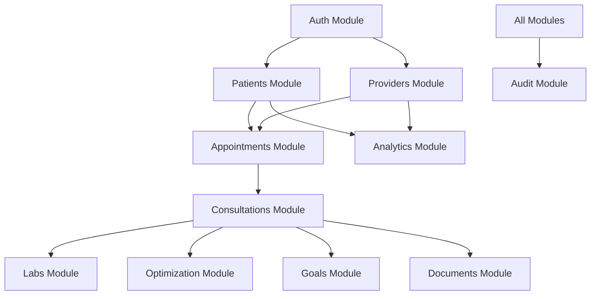

# Project Review & Architecture Documentation
**System Name:** Longevity Telehealth Platform (99purityX Backend)  
**Author:** Technical Reviewer  
**Date:** July 18, 2026  

---

## 1. Executive Summary & Architecture Overview

The **99purityX Backend** is a modern, modular, asynchronous API built with **FastAPI** and **SQLAlchemy**. The codebase follows clean architecture principles designed as a **Modular Monolith**, where each domain is encapsulated inside its own module folder. This structure allows the project to scale easily and isolates database models, schemas, and business logic per domain.

### Technical Stack
* **Web Framework:** FastAPI (Asynchronous ASGI framework)
* **ASGI Server:** Uvicorn
* **Database Toolkit:** SQLAlchemy 2.0 (using `asyncpg` for async PostgreSQL connection)
* **Database Migrations:** Alembic
* **Environment & Settings Config:** Pydantic Settings
* **Testing:** Pytest with Pytest-Asyncio
* **Dependency Management:** UV (Astral)

---

## 2. Directory Structure

The project conforms to a clean division of concerns:

```
99purityX-backend/
├── app/
│   ├── config/                 # Global Settings & Pydantic config
│   ├── infrastructure/         # Core database session setup, migrations entry point
│   │   └── database/           # Base model metadata, session management, common Mixins
│   ├── modules/                # Core Business Domains (Detailed below)
│   └── main.py                 # FastAPI application initializer & Route registry
├── alembic.ini                 # Migrations configuration file
├── requirements.txt            # Package dependencies
└── pyproject.toml              # Build & tool definitions
```

Within each module inside `app/modules/`, a structured layout is maintained:
* `api/` — API Routes (Controllers), Request/Response Schemas (Pydantic), and endpoint dependencies (e.g., Auth guards).
* `models/` — Database Models (SQLAlchemy Declarative).
* `services/` — Business Logic layer.
* `repositories/` (optional) — Data Access Layer.
* `enums/` / `constants/` — Domain-specific constraints.

---

## 3. Module Breakdown & Functionalities

There are **11 core modules** defining the functionalities of the platform:



### 3.1 `auth` — Authentication & Access Control
* **Account Provisioning:** Handles user registration and sends OTP verification codes.
* **Authentication Options:** Supports email/password login and native Google OAuth login integration.
* **Token Management:** Manages short-lived JWT access tokens and long-lived refresh tokens.
* **Access Control (RBAC):** Restricts endpoints using role-based permissions (Roles: Admin, Provider, Patient).

### 3.2 `patients` — Patient Profiles
* **Bio-metrics & Demographics:** Captures gender, date of birth, blood group, height (cm), and weight (kg).
* **Metadata & Settings:** Handles emergency contact details, timezone mappings, and language preferences.
* **References:** Coordinates relationship links to the patient's consultations, optimization schedules, goals, and uploaded health documents.

### 3.3 `providers` — Provider Profiles
* **Professional Attributes:** Defines clinician type, specialty, license number, active status, and years of experience.
* **Billing:** Handles clinician-specific consultation fees.
* **Scheduling:** Ties into appointment allocation, consultation history, and analytics snapshots.

### 3.4 `appointments` — Scheduling Engine
* **Booking Lifecycle:** Schedules, updates, and cancels appointments between patients and providers.
* **Tracking:** Records appointment reasons, scheduled start/end times, custom status states (`SCHEDULED`, `COMPLETED`, `CANCELLED`), and clinical notes.

### 3.5 `consultations` — Electronic Health Records (EHR)
* **Clinical Encounters:** Serves as the central EHR node initiated from an appointment.
* **Notes:** Captures chief complaints, provider notes, case summaries, and follow-up flags.
* **Orchestration:** Acts as the parent node linking newly generated Lab Orders, Optimization Programs, Health Goals, and Documents created during the visit.

### 3.6 `labs` — Diagnostics & Orders
* **Lab Orders:** Generates test order records during consultations.
* **Lab Results:** Links returned diagnostic reports and raw values to the patient's medical file.

### 3.7 `optimization` — Longevity Protocols
* **Optimization Programs:** Multi-week structured programs prescribed to patients during consultations.
* **Habit Protocols:** Actionable daily habits (e.g., hydration, sleep, exercise) prescribed by providers.
* **Habit Logs:** Compliance tracking enabling patients to mark off completed habits.
* **Peptide Protocols:** Custom administration rules for peptide therapies including dosage, route, frequency, and duration.

### 3.8 `goals` — Health Objectives
* **Goal Settings:** Patient-oriented health targets (e.g., cardiovascular metrics, body fat percentage).
* **Progress Tracking:** Records updates against baseline goals over time to show success metrics.

### 3.9 `documents` — Document Repository
* **Storage Integration:** Manages file upload metadata including original file names, storage keys, MIME types, and file sizes.
* **Entity Association:** Links medical files, scan results, or PDFs to specific patients, providers, consultations, or lab orders.

### 3.10 `analytics` — System Insights & Performance
* **Patient Health Scoring:** Tracks overall health grades computed from biometric and compliance history.
* **Provider Analytics:** Performance metrics (e.g., average ratings, patients served, total consultations).
* **Program Analytics:** Aggregates telemetry data to rate the effectiveness of programs.

### 3.11 `audit` — Audit Logging & Compliance
* **Action Logs:** Captures system-wide security, data alteration, and user actions.
* **Context:** Tracks IP addresses, timestamp, target module, action type, and actor details to maintain a HIPAA-compliant access trail.

---

## 4. Key Reviewer Observations
1. **Separation of Concerns:** The modular structure is excellent. Business logic is separated from HTTP routing, making testing simple.
2. **Database Integration:** SQLAlchemy 2.0's type-safe `Mapped[...]` columns are utilized correctly. All relationships are properly configured with appropriate cascades.
3. **Pydantic Setup:** Strong typing is applied to all incoming request payloads and outgoing response schemas.
4. **Security Integrity:** A granular RBAC system ensures security constraints are validated on every route, maintaining data isolation between patients and providers.
